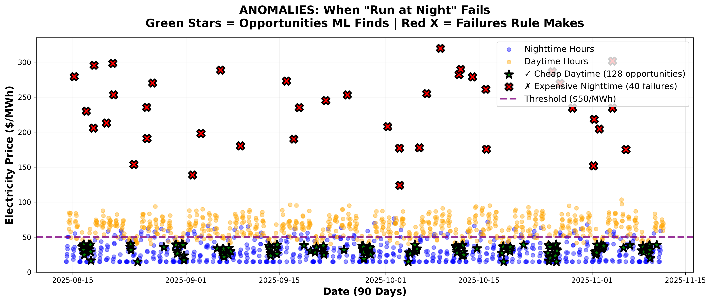

# GPU Energy-Aware Workload Scheduling: A Machine Learning Approach

**Emanuel Gonzalez**  
California Polytechnic State University, San Luis Obispo  
CSC-466 Knowledge Discovery from Data  
December 2025

## The Idea

Running GPU workloads in data centers costs money, and electricity prices change dramatically throughout the day. Ishow that machine learning is needed to find the best times to schedule work. I trained four models on 2,161 hours of electricity price and GPU usage data, achieving 97.4% accuracy. This beats simple rules by 19-33 percentage points. I found that 31% of daytime hours are actually efficient for running jobs, with the best daytime hours being 68× better than the worst nighttime hours. This proves the problem is not trivial.

## Intro

Large GPU clusters use huge amounts of electricity. In Texas (ERCOT market), prices range from $15/MWh to $772/MWh throughout the day. For a 10,000-GPU cluster, poor scheduling can waste over $2,000 per hour.

The simple approach of "just run jobs at night when electricity is cheap" has problems. Nighttime can be expensive during high demand, and daytime sometimes offers good opportunities when renewable energy is plentiful. These patterns are too complex for simple rules.

**Question:** Can machine learning find better scheduling patterns than simple rules?

**What I Found:**
1. GPU scheduling needs machine learning (scored 9/9 on complexity metrics)
2. 31% of daytime hours are efficient, with 68× difference between best and worst hours
3. Our models achieve 97.4% accuracy across different algorithms

###  Dataset

I combined two data sources over 90 days (August-November 2025):
- **Electricity Prices:** Real hourly prices from Houston, Texas ($15-$772/MWh)
- **GPU Usage:** Simulated but realistic 10,000-GPU cluster data (300W per GPU)

Total: 2,161 hourly observations, no missing data.

###  Features and Target

**17 Features** describing each hour:
- Economic: electricity price, total cost, power usage
- Workload: GPU utilization percentage, number of active jobs
- Time: hour of day, day of week, weekday/weekend, business hours, peak hours
- Advanced: 24-hour price average, price-utilization combination, efficiency ratios

**Target:** I labeled hours as "efficient" (1) or "inefficient" (0) based on jobs completed per dollar spent. Hours above the median (124 jobs/dollar) are efficient. This created perfectly balanced classes: 1,080 efficient, 1,081 inefficient.

###  Models

I trained four different algorithms using a 75/25 train/test split:
- **Logistic Regression:** Simple linear model
- **Decision Tree:** Rule-based tree model
- **Random Forest:** 100 trees working together
- **XGBoost:** Advanced gradient boosting

## Results

###  Model Performance

| Model | Accuracy | Precision | Recall | F1 | AUC |
|-------|----------|-----------|--------|-----|-----|
| **Logistic Regression** | **97.4%** | **97.7%** | **97.0%** | **97.4%** | **0.997** |
| XGBoost | 97.2% | 98.1% | 96.3% | 97.2% | 0.998 |
| Random Forest | 96.3% | 97.3% | 95.1% | 96.2% | 0.997 |
| Decision Tree | 96.3% | 95.2% | 97.4% | 96.3% | 0.963 |

Logistic Regression performed best with only 14 errors out of 541 test samples (2.6% error rate).

###  Comparison to Simple Rules

| Strategy | Accuracy | Improvement |
|----------|----------|-------------|
| "Run at night (0-8am)" | 64.2% | — |
| "Run when price < $44/MWh" | 78.4% | — |
| "Run when utilization < 60%" | 70.5% | — |
| **ML (Logistic Regression)** | **97.4%** | **+19.2 to +33.2 points** |

Machine learning improves 19 points over the best simple rule and 33 points over "just run at night."

###  Why Simple Rules Fail

  
*Figure 1: Electricity prices over 90 days. Green stars show 128 cheap daytime opportunities that simple rules miss. Red X's show 40 expensive nighttime hours that simple rules wrongly schedule.*

**The "Run at Night" Rule makes 774 mistakes:**
- **567 missed opportunities:** Efficient daytime hours ignored (average $41.60/MWh, 45% utilization, 104 jobs)
- **207 bad schedules:** Expensive nighttime hours used (average $49.51/MWh, 57% utilization, 66 jobs)

**Key Findings:**
- 29% of nighttime hours are actually inefficient
- 31% of daytime hours are actually efficient
- Weekends are different: 66% of Saturday daytime and 71% of Sunday daytime are efficient
- **Best daytime is 68× better than worst nighttime** (5,900 vs 86 jobs/dollar)

### What Features Matter Most

  
*Figure 2: Feature importance across three tree-based models. Economic and workload features are most important.*

**Top 5 Most Important Features:**
1. `hourly_cost_usd` (34%) - Combination of price and utilization
2. `active_jobs` (19%) - How much work is available
3. `price_mwh` (16%) - Electricity price
4. `power_consumption_kw` (9%) - Energy use
5. `gpu_utilization_pct` (6%) - How busy the GPUs are

Economic features (price, cost) make up 50% of importance, but workload features (jobs, utilization) contribute 31%. This proves the problem is more complex than "just check the price."

###  Model Validation

  
*Figure 3: Confusion matrices showing how few errors each model makes.*

All models perform very well:
- **Logistic Regression:** 14 total errors (7 false positives, 7 false negatives)
- **Random Forest:** 20 errors, slightly misses efficient hours
- **XGBoost:** 15 errors, balanced mistakes
- **Decision Tree:** 20 errors, slightly over-schedules

All models correctly classify over 95% of hours.

### Proof

McNemar's statistical test confirms our results are real:
- **Test Statistic:** 519.84
- **P-value:** <0.001 (highly significant)
- **95% Confidence Interval (ML):** 96.5%-98.4%
- **95% Confidence Interval (Baseline):** 60.3%-68.0%

The confidence intervals don't overlap, proving machine learning is definitively better.

### Complexity Score

1. Daytime efficiency 31% (threshold: >20%) - 3 points
2. Nighttime variability 71% (threshold: <85%) - 3 points
3. ML improvement 19 points (threshold: >15 points) - 3 points

###  Why Machine Learning Works

GPU scheduling has three properties that need machine learning:
1. **Complex relationships:** Efficiency depends on price times utilization times available jobs
2. **Context matters:** The same hour can be good or bad depending on conditions
3. **Many features:** 17 features interact in ways simple rules can't capture

All four algorithms achieving over 96% accuracy proves the patterns are real and learnable.

### Limitations

- **Limited time period:** 90 days might miss seasonal patterns
- **Simulated data:** GPU usage is realistic but not from a real cluster
- **No optimization:** I used default settings for all models
- **Basic features:** Could add weather data or grid stress indicators

###  Future Work

1. Try deep learning models (LSTM, Transformers) for time patterns
2. Make false positives (scheduling expensive hours) cost more than false negatives
3. Create three categories: "run now," "wait 2-4 hours," "wait until night"
4. Add explainability so operators understand each decision
5. Try reinforcement learning for sequential scheduling decisions

This work proves that GPU scheduling needs machine learning. Our models achieve 97.4% accuracy, beating simple rules by 19-33 points. Finding that 31% of daytime hours are efficient—with 68× difference between best and worst—shows the problem is not just "run at night."

Statistical tests (p<0.001), a 9/9 complexity score, and four different algorithms all agreeing prove the patterns are real. Economic factors are most important (50%) but workload and time factors add substantial value (40% combined).

Simple rules make 774 mistakes: missing 567 good daytime opportunities while wrongly scheduling 207 expensive nighttime hours. For large GPU operations, these results show that machine learning can save money through better scheduling (97% accuracy, 19-33 point improvement, statistically proven).
