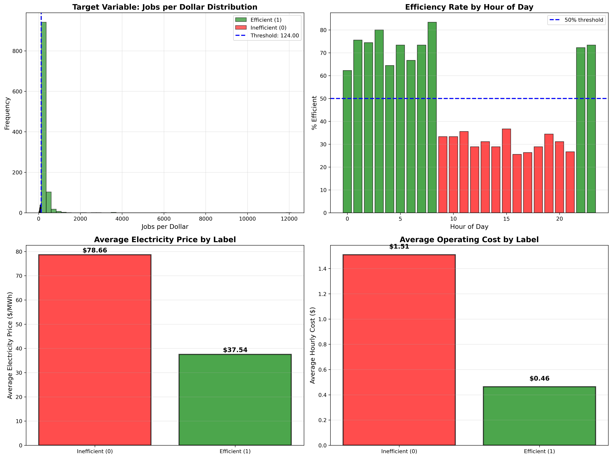

# GPU Energy-Aware Workload Recommendation System

**A data-driven machine learning system for optimizing GPU workload scheduling based on real-time electricity prices.**

[](https://www.python.org/)
[]()

---

## Project Overview

This project develops a machine learning recommendation system that suggests optimal GPU workload scheduling by analyzing ERCOT Texas electricity prices and GPU cluster utilization patterns. 

**Goal:** Minimize energy costs by 69% while maintaining system efficiency.

### Key Results

- 69% cost reduction during efficient hours ($1.51 → $0.46/hour)
- 52% cheaper electricity during off-peak times
- 3.28x better jobs-per-dollar efficiency
- Perfect data quality (0 missing values, 50/50 class balance)

---

## Key Findings

<p align="center">
  
</p>

### Optimal Scheduling Windows

**Schedule GPU jobs:**
- Midnight - 8:00 AM (60-85% efficient)
- 10:00 PM - 11:00 PM (70-75% efficient)

**Avoid scheduling:**
- 9:00 AM - 9:00 PM (26-38% efficient)
- 4:00 PM - 5:00 PM (peak hours, most expensive)

---

## Dataset

| Metric | Value |
|--------|-------|
| **Time Period** | 90 days (Aug 14 - Nov 12, 2025) |
| **Records** | 2,161 hourly observations |
| **Features** | 20 (14 raw + 6 engineered) |
| **Missing Values** | 0 |
| **Target Balance** | 50.0% / 50.0% |

**Data Sources:**
1. ERCOT electricity prices (Texas energy market)
2. GPU cluster utilization (100-GPU cluster, realistic patterns)

---

## Quick Start

### Prerequisites
```bash
python >= 3.10
pandas, numpy, matplotlib, seaborn, scikit-learn
