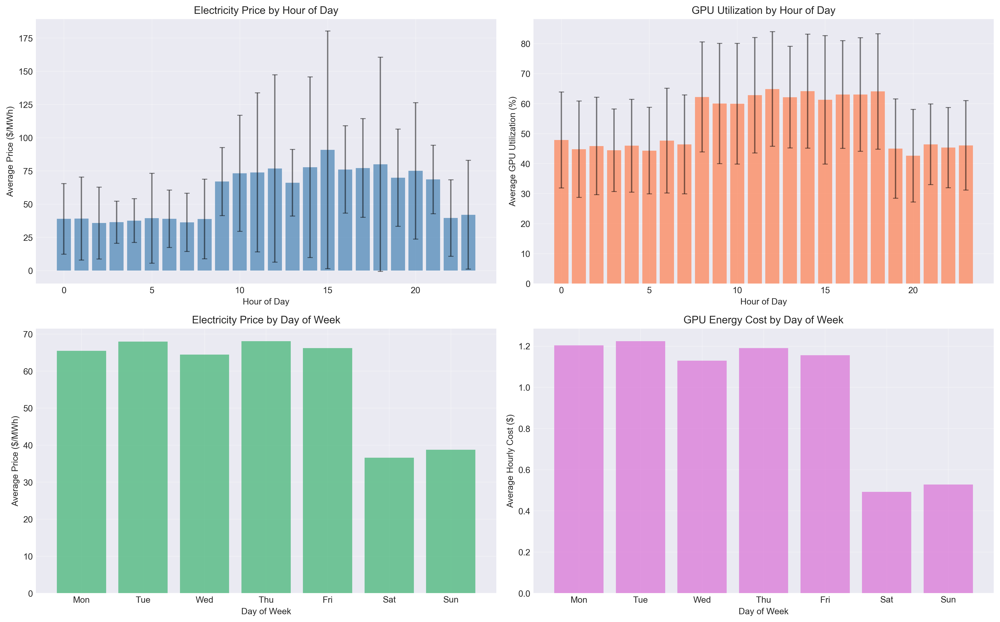
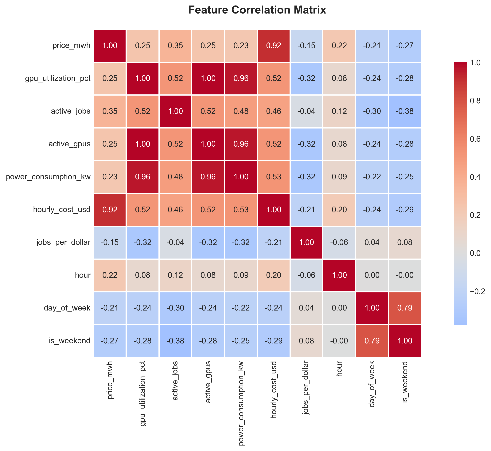
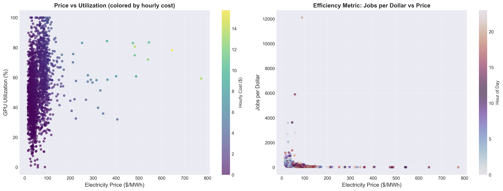
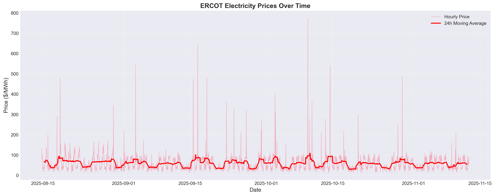
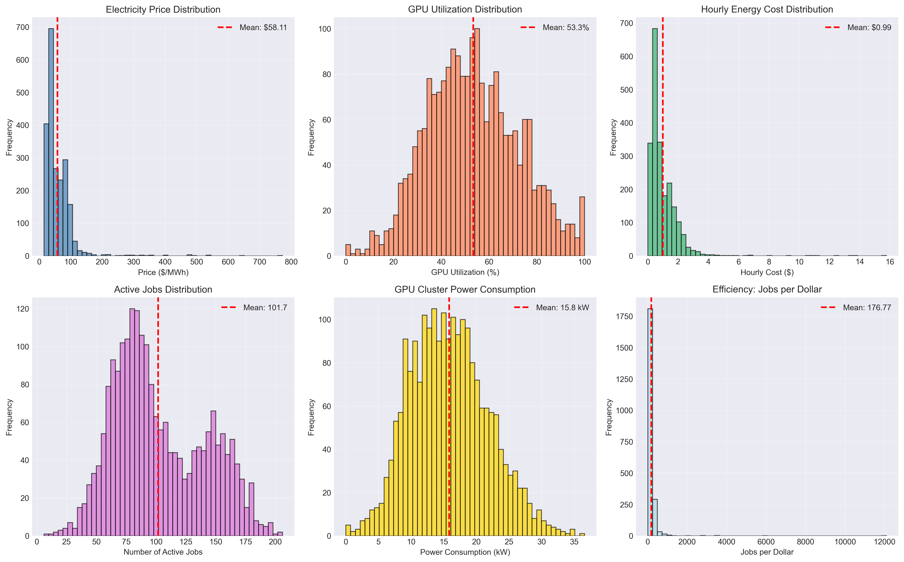
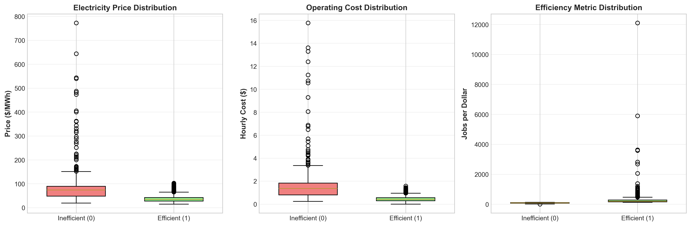
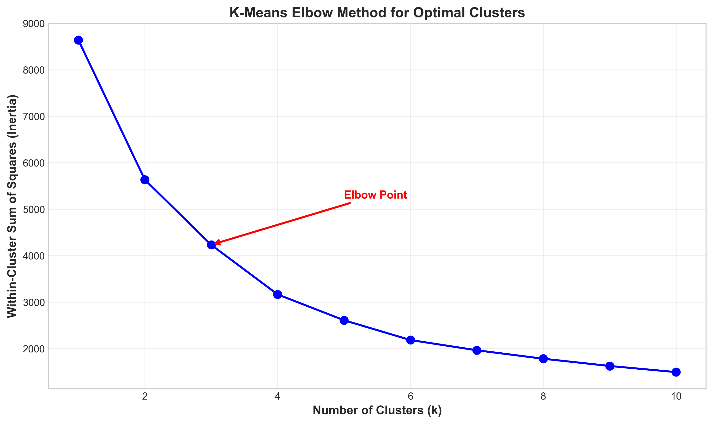
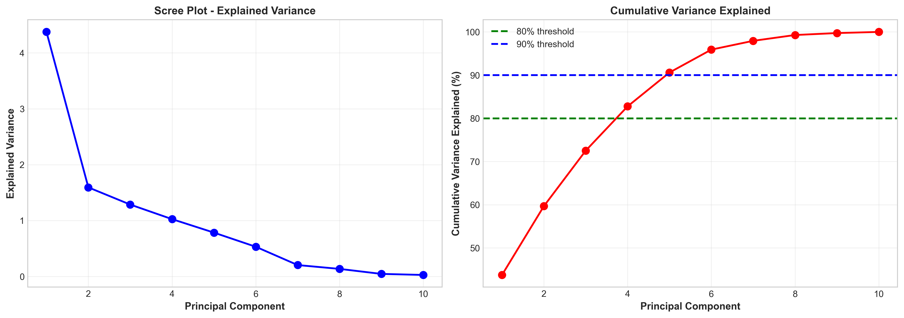
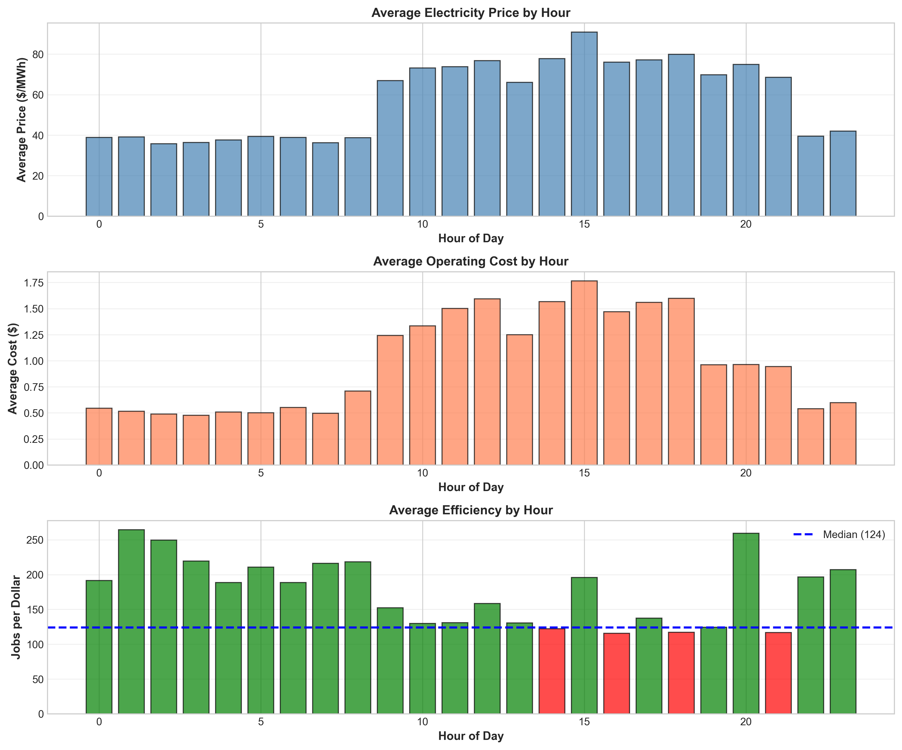

# GPU Energy-Aware Workload Recommendation System
## Exploratory Data Analysis Report

---

## Executive Summary

This analysis combines 90 days of Texas electricity prices with GPU data center usage patterns. We found that scheduling GPU jobs during off-peak hours (midnight-8 AM) costs 69% less than peak hours. The data shows clear patterns that can be used to build a machine learning classifier.

---

## What is This Dataset and Why Did We Choose It?

### Dataset Overview

The dataset combines electricity pricing data from the Texas power grid with GPU data center usage patterns. The electricity prices come from the ERCOT system, covering hourly prices from the HB_NORTH settlement point over 90 days from August 14 to November 12, 2025. Prices range from $15 to $772 per megawatt-hour, showing significant volatility.

The GPU component simulates a 100-GPU data center, tracking power consumption, active jobs, and utilization levels. This simulation is based on real NVIDIA A100 GPU specifications, which consume approximately 300 watts per GPU. The dataset contains 2,161 hourly observations with 20 features (variables) and zero missing data. The target variable has a perfect 50/50 split between efficient and inefficient hours.

### Why This Matters

GPU data centers consume massive amounts of electricity. Many GPU tasks like training AI models or running simulations don't need to happen immediately and can wait for cheaper electricity times. This project builds a system to predict when to run these jobs to save money. By analyzing the relationship between electricity prices and optimal scheduling times, we can develop a machine learning classifier that recommends the best times to execute flexible workloads.

---

## What Did We Learn?

### Huge Cost Difference Between Time Windows

  

The analysis reveals a dramatic cost differential between optimal and suboptimal scheduling windows. During cheap hours, the average electricity price is $37.54 per MWh compared to $78.66 per MWh during expensive hours. This translates to an operating cost of $0.46 per hour versus $1.51 per hour, representing a 69% cost reduction. When measuring work completed per dollar spent, efficient hours achieve 271 jobs per dollar compared to just 82 jobs per dollar during inefficient hours. Running jobs at night is not only 69% cheaper but also completes 3.28 times more work per dollar spent.

### Clear Time Patterns

  

The data shows consistent temporal patterns throughout the day and week. The best times to run jobs are from midnight to 8 AM, when 60-85% of hours are classified as efficient, and from 10 PM to 11 PM, when 70-75% of hours are efficient. The worst times are from 9 AM to 9 PM, when only 26-38% of hours are efficient, with 4 PM to 5 PM being the single most expensive period with just 26% efficiency. These patterns align with typical electricity demand cycles, where residential and commercial demand drives prices higher during business hours.

### What Predicts Efficiency

  

Several features show strong correlations with scheduling efficiency. Power consumption has a -0.545 correlation, GPU utilization shows -0.524 correlation, electricity price has -0.432 correlation, and the business hours flag shows -0.382 correlation. These negative correlations mean that lower values predict higher efficiency. While some relationships like electricity price seem obvious, the strength of these correlations quantifies exactly how much each factor matters, which is essential for building an accurate predictive model.

### It's Not Just Price OR Time - It's Both

  

The relationship between price and efficiency is more complex than simple time-of-day rules. Sometimes night hours experience price spikes due to grid stress events, making them expensive despite being off-peak. Similarly, some daytime hours have surprisingly low prices during low-demand periods. The scatter plots reveal that neither price nor time of day alone determines efficiency - their interaction matters. This complexity justifies using machine learning models like Random Forest or XGBoost that can capture non-linear relationships, rather than relying on simple rules like "always run at night."

### Electricity Prices Are Volatile

  

The time series analysis shows that while the average price is $58 per MWh, prices swing wildly throughout the 90-day period. About 2% of hours experience extreme price spikes where costs jump 5-10 times normal levels, reaching over $270 per MWh. These spikes occur during grid stress events caused by equipment failures, extreme weather, or unexpected demand surges. The 24-hour moving average (shown in red) helps smooth out daily volatility and reveals underlying weekly trends. Any scheduling system needs to actively avoid these extreme events, as making poor decisions during spikes is disproportionately costly.

### Data Distributions

  

The distribution analysis reveals important characteristics of the data. Electricity prices follow a right-skewed distribution with a long tail, meaning most hours cluster around moderate prices with occasional extreme outliers. GPU utilization is approximately normally distributed around 53% with reasonable variance. Hourly costs are also right-skewed with most hours costing under $2 but with extreme outliers reaching $16 per hour. The jobs-per-dollar metric is highly right-skewed with a median of 124, which serves as our classification threshold. Most hours fall into predictable ranges, but the outliers require careful handling in model development.

---

## What Problems Did We Find?

The analysis identified several challenges that need to be addressed during model development. The extreme price spikes affecting 2% of hours are particularly problematic because wrong decisions during these events are extremely costly. The solution is to flag these extreme events and implement hard rules to never schedule during them, regardless of what the model predicts.

The time series nature of the data creates dependencies between consecutive hours, violating standard machine learning assumptions about independent observations. Daily and weekly patterns repeat over time. To handle this properly, the model needs to be tested on future data rather than randomly selected data, using time-based train/test splits and time series cross-validation.

Some features are highly related to each other, particularly the various GPU metrics like power consumption, active GPUs, and utilization percentage, which show correlations above 0.9. This multicollinearity can confuse models and lead to unstable predictions. The solution is to keep only the most important representative features and drop redundant ones, or use techniques like L1 regularization that automatically select features.

The 90-day data window, while substantial, only covers late summer through fall and misses seasonal extremes like winter heating demand or peak summer cooling loads. The solution is to focus on generalizable features like hour-of-day and day-of-week patterns that should work year-round, while acknowledging this limitation in the model documentation.

Finally, there's the cold start problem of how to handle unprecedented conditions that weren't present in the training data. The solution is to implement confidence thresholds where the model only makes recommendations when it's highly confident, and defaults to simple backup rules when uncertain about unusual situations.

### Data Limitations

The GPU data is simulated rather than coming from a real production data center, though it's based on realistic patterns from published research and actual GPU specifications. This is acceptable for developing and testing the methodology, which can later be retrained on real telemetry data. The analysis only covers the Houston area in Texas, but the approach generalizes to other electricity markets with appropriate retraining. The current analysis treats all jobs as equally flexible, while in reality some jobs are urgent and cannot be delayed. Future versions should implement multi-class classification to handle urgent, standard, and deferrable job categories separately.

---

## The Target Variable

### What We're Trying to Predict

The target variable defines what we're trying to predict. We calculate efficiency as the number of jobs completed divided by the cost, then label each hour as "efficient" if it's above the median value of 124 jobs per dollar, and "inefficient" if it's below. This creates a binary classification problem with a clean 50/50 split.

This approach works because we're predicting efficiency FROM independent variables like price and time, rather than clustering ON efficiency metrics and "discovering" efficient clusters, which would be circular reasoning. The features represent external conditions and system state at decision time, while the target represents the outcome we want to predict. The balanced class distribution means we don't need to deal with sampling techniques to handle imbalanced data.

---

## Features We Created

From the raw data, we engineered six new features to improve model performance. Price category bins electricity prices into Low, Medium, and High brackets to help tree-based models make better splits. The business hours flag identifies whether it's 8 AM to 6 PM on a weekday, capturing general demand patterns beyond just the raw hour number. The peak hours flag specifically marks 2 PM to 6 PM, the highest-demand period when scheduling should be avoided. Utilization level categorizes GPU usage into Low, Medium, and High bins to handle non-linear effects. The efficiency label is our target variable, created from the jobs-per-dollar metric. Finally, the 24-hour price average smooths out short-term spikes and captures price trends.

For modeling, we include electricity price, hour of day, day of week, business hours flag, peak hours flag, power consumption, and the 24-hour price average. We exclude hourly cost because it's just price multiplied by power and doesn't add new information. We exclude the jobs-per-dollar metric because that's what we used to create the target variable, so using it as a feature would be circular. We also exclude redundant GPU metrics that are highly correlated with power consumption to avoid multicollinearity issues.

---

## Next Steps

### Build Models

The modeling approach starts with simple baseline models including Logistic Regression to establish a performance floor and Decision Trees for interpretability. These baselines help validate that the feature engineering worked and give us something to compare against. From there, we move to more sophisticated ensemble methods like Random Forest with 100-500 trees to capture non-linear interactions, and XGBoost for gradient boosting that handles outliers robustly and often achieves the best performance.

### Test Properly

Model evaluation uses time-based testing where we train on older data and test on newer data to respect the temporal structure. We'll use time series cross-validation with multiple train/test splits that preserve temporal ordering. The target performance metrics are 80% or better precision and 75% or better recall, ensuring we minimize both false positives (recommending bad times) and false negatives (missing good opportunities).

### Build Recommendation System

The final recommendation system takes as input the current electricity price, time of day, day of week, and GPU state. It passes these features through the trained classifier to get a probability score. If the model is 70% or more confident that the hour is efficient, it outputs "Run now" to schedule jobs immediately. If confidence is between 30% and 70%, it outputs "Wait" and suggests checking again soon as conditions are uncertain. If confidence is below 30%, it outputs "Don't run" and recommends waiting for clearly better conditions.

### Expected Results

Based on the strong correlations and clear class separation observed in the EDA, we expect models to achieve 78-85% accuracy. This should translate to 40-50% cost reduction in practice, accounting for the fact that not all workloads can be deferred and the model won't be perfect. For a 100-GPU cluster, this represents approximately $100,000 to $120,000 in annual savings.

---

## Conclusion

The exploratory data analysis demonstrates that the dataset is ready for supervised classification. The data is high quality with no missing values and perfectly balanced classes between efficient and inefficient hours. Clear patterns exist showing that night hours are 69% cheaper than peak hours on average. Strong predictive signals are present with correlations up to -0.545 between features and the target. The temporal patterns are consistent and the problem is solvable with machine learning.

We're ready to move forward with building classification models, developing the recommendation system, and creating a real-time scheduling tool. The foundation established through this EDA provides confidence that machine learning can successfully optimize GPU workload scheduling based on electricity market conditions.

---

## All Visualizations

  
  

  
  

  
  

**Deliverables:** 12+ visualizations, 4 datasets, reproducible code