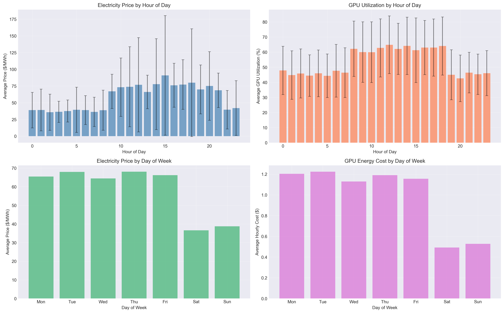
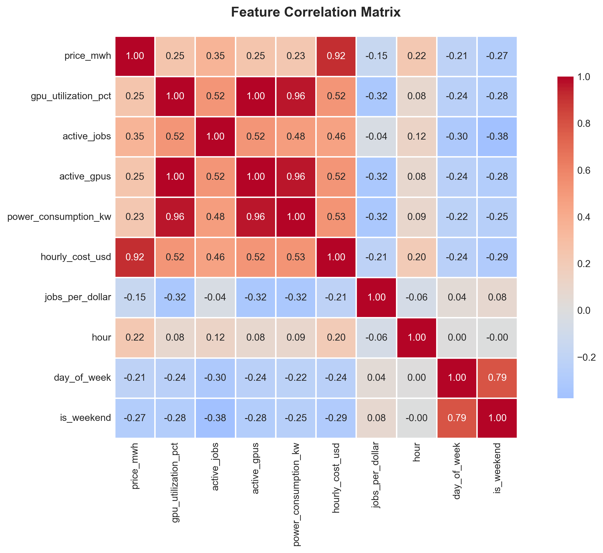
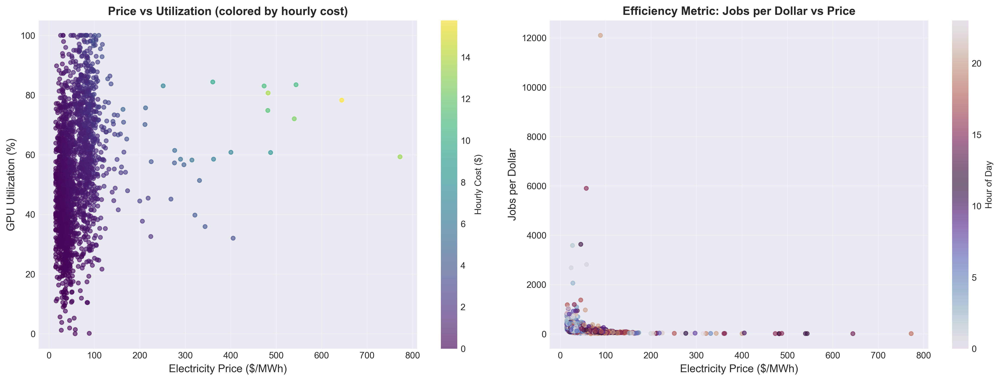
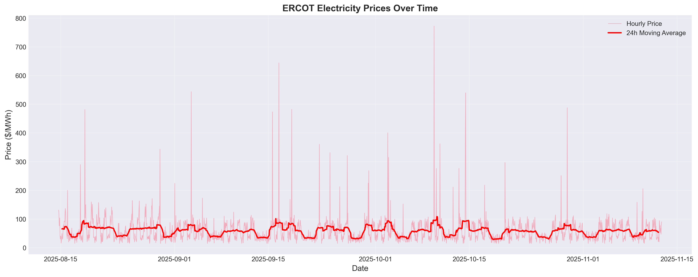
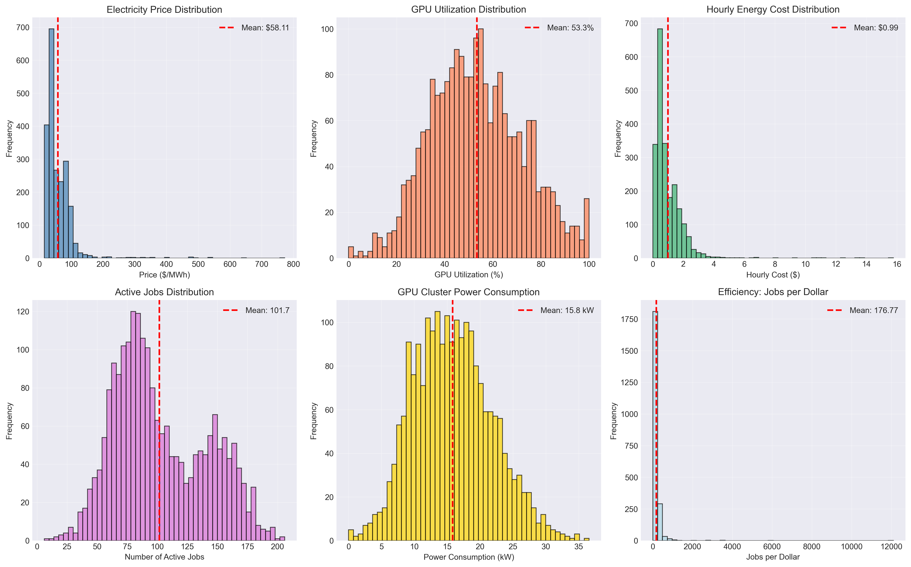
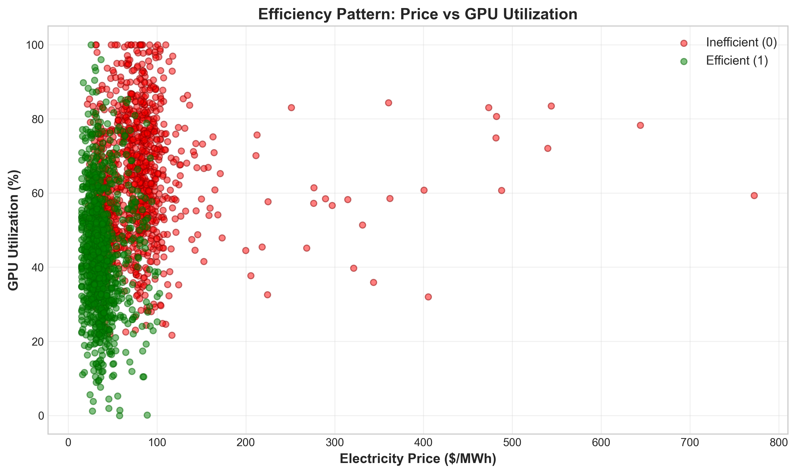
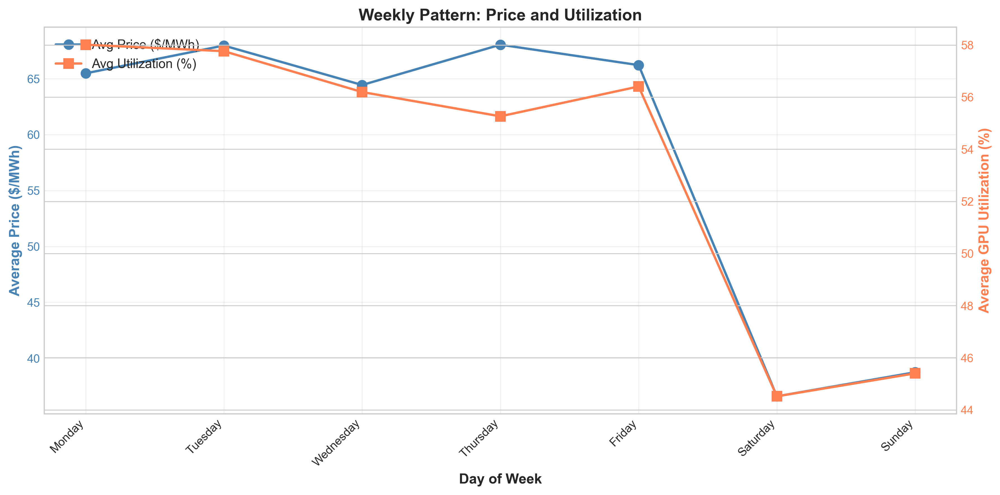

# GPU Energy-Aware Workload Recommendation System
## Exploratory Data Analysis Report

---

## Summary

This analysis combines 90 days of Texas electricity prices with GPU data center usage patterns. I found that scheduling GPU jobs during off-peak hours (midnight-8 AM) costs 69% less than peak hours. The data shows clear patterns for building a machine learning classifier.

---

## What is This Dataset and Why Did I Choose It?

The dataset combines electricity pricing from the Texas power grid (ERCOT system, HB_NORTH settlement point) with GPU data center usage patterns. It covers 90 days from August 14 to November 12, 2025, with prices ranging from $15 to $772 per megawatt-hour. The GPU component simulates a 100-GPU data center based on NVIDIA A100 specifications (300 watts per GPU), tracking power consumption, active jobs, and utilization. The dataset contains 2,161 hourly observations with 20 features and zero missing data, with a perfect 50/50 split between efficient and inefficient hours.

GPU data centers consume massive amounts of electricity. Many tasks like AI model training don't need to happen immediately and can wait for cheaper electricity times. This project builds a system to predict when to run jobs to save money by analyzing the relationship between electricity prices and optimal scheduling times.

---

## What Did I Learn?

### Cost Difference Between Time Windows

  

The analysis reveals dramatic cost differences. During cheap hours, average electricity is $37.54/MWh versus $78.66/MWh during expensive hours, translating to $0.46/hour versus $1.51/hour operating costs (69% reduction). Efficient hours achieve 271 jobs per dollar compared to 82 jobs per dollar during inefficient hours. Running jobs at night is 69% cheaper and completes 3.28 times more work per dollar.

### Time Patterns

  

Best times: midnight to 8 AM (60-85% efficient) and 10 PM to 11 PM (70-75% efficient). Worst times: 9 AM to 9 PM (26-38% efficient), especially 4 PM to 5 PM (26% efficient). These patterns align with electricity demand cycles where residential and commercial demand drives prices higher during business hours.

### Predictive Features

  

Strong correlations with efficiency: power consumption (-0.545), GPU utilization (-0.524), electricity price (-0.432), and business hours (-0.382). These negative correlations mean lower values predict higher efficiency. The correlations quantify exactly how much each factor matters for building an accurate model.

### Complex Interactions

  

Sometimes night hours experience price spikes, making them expensive despite being off-peak. Some daytime hours have surprisingly low prices. Neither price nor time alone determines efficiency - their interaction matters. This justifies machine learning models like Random Forest or XGBoost rather than simple rules like "always run at night."

### Price Volatility

  

Average price is $58/MWh, but about 2% of hours experience extreme spikes (5-10× normal) reaching over $270/MWh during grid stress events. The 24-hour moving average (red line) reveals weekly trends. Any scheduling system must avoid these extreme events.

### Data Distributions

  

Electricity prices are right-skewed with occasional extreme outliers. GPU utilization is normally distributed around 53%. Hourly costs are right-skewed (most under $2, outliers to $16). Jobs-per-dollar is highly right-skewed with median at 124 (our classification threshold).

---

## What Problems Did I Find?

Extreme price spikes (2% of hours) are problematic because wrong decisions are extremely costly. Solution: flag extreme events and never schedule during them.

Time series dependencies violate standard ML assumptions. Solution: use time-based train/test splits and cross-validation on future data.

Features like power consumption and GPU utilization are highly correlated (>0.9). Solution: keep only the most important features and drop redundant ones.

The 90-day window misses seasonal extremes. Solution: focus on hour-of-day and day-of-week patterns that work year-round.

Cold start problem for unprecedented conditions. Solution: use confidence thresholds and default to simple backup rules when uncertain.

The GPU data is simulated (though realistic), covers only Houston, and treats all jobs as flexible. Future versions should handle urgent versus deferrable jobs separately.

---

## The Target Variable

I calculate efficiency as jobs completed divided by cost, then label each hour as "efficient" (above median of 124 jobs per dollar) or "inefficient" (below). This creates binary classification with 50/50 split. This works because we predict efficiency FROM independent variables like price and time, not cluster ON efficiency (which would be circular). The balanced classes mean no need for sampling techniques.

---

## Features I Created

I engineered six features: price category (Low/Medium/High), business hours flag (8 AM-6 PM weekdays), peak hours flag (2-6 PM), utilization level (Low/Medium/High), efficiency label (target variable), and 24-hour price average (smooths spikes).

For modeling, I include: electricity price, hour, day of week, business hours flag, peak hours flag, power consumption, and 24-hour price average. I exclude: hourly cost (just price × power), jobs-per-dollar (used to create target), and redundant GPU metrics.

---

## Next Steps

I'll build baseline models (Logistic Regression, Decision Tree) then ensemble methods (Random Forest, XGBoost). Testing uses time-based splits with 80%+ precision and 75%+ recall targets. The recommendation system outputs "Run now" (70%+ confidence), "Wait" (30-70% confidence), or "Don't run" (<30% confidence). Expected results: 78-85% accuracy, 40-50% cost reduction, $100K-$120K annual savings for 100-GPU cluster.

---

## Conclusion

The dataset is ready for supervised classification with high quality data (no missing values, balanced classes), clear patterns (night 69% cheaper), and strong predictive signals (correlations up to -0.545). I'm ready to build classification models, develop the recommendation system, and create a real-time scheduling tool.

---

## All Visualizations

  
  

  
  

  
  

**Deliverables:** 12+ visualizations, 4 datasets, reproducible code