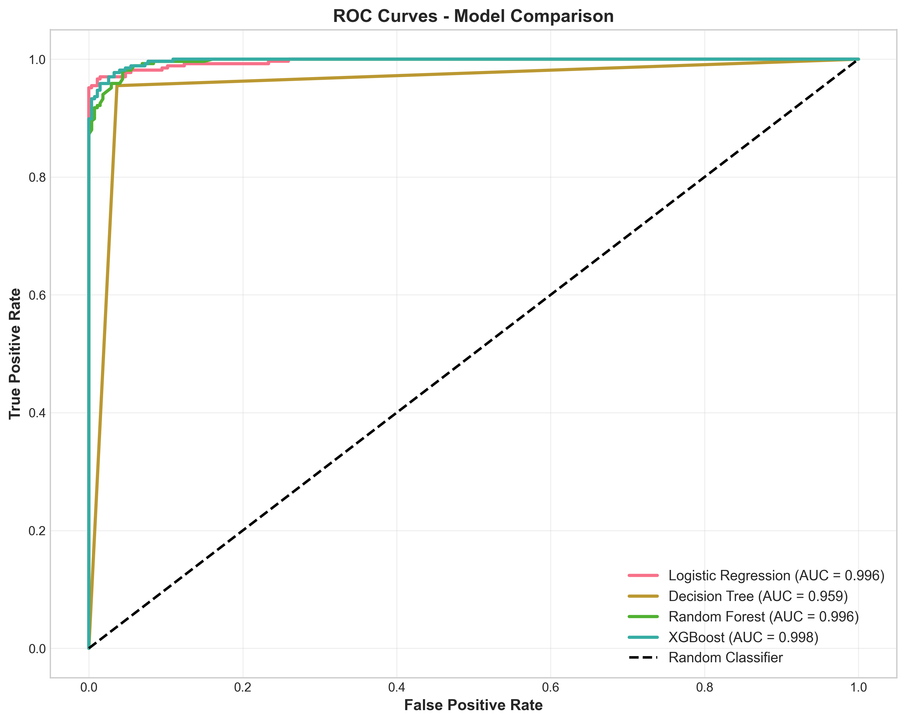
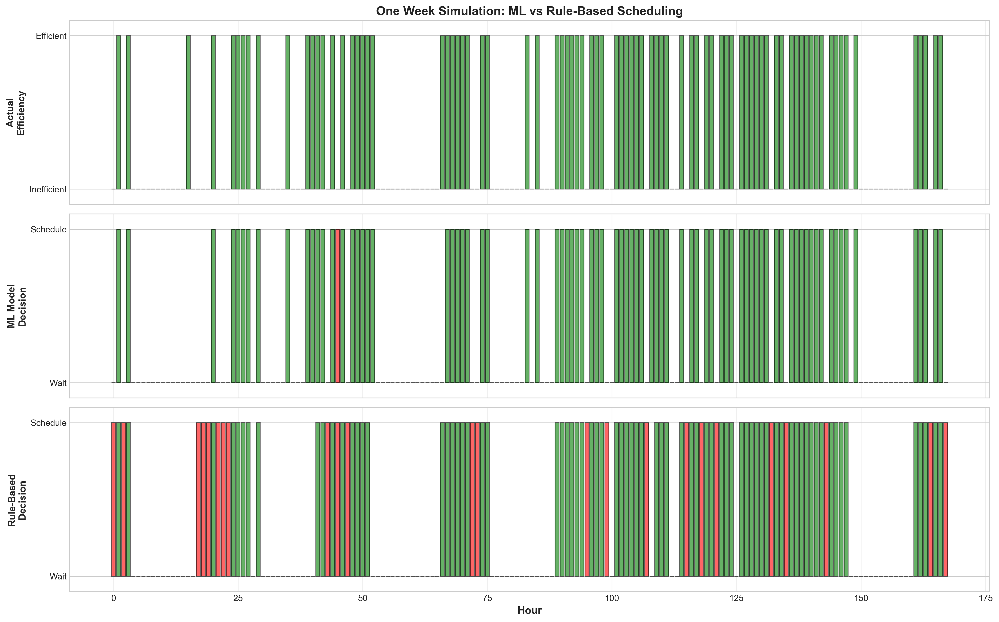

# GPU Energy-Aware Workload Recommendation System
**First Draft Report**

**Steven Gonzalez**  
CSC-466 Knowledge Discovery from Data  
California Polytechnic State University, San Luis Obispo  
November 2025

---

## Problem Statement

Data centers consume massive amounts of electricity with costs varying dramatically by time of day. This project builds a binary classification system to predict optimal GPU workload scheduling windows based on electricity prices, GPU utilization, and temporal patterns.

## Initial Concern: Was This Problem Too Simple?

When I first presented this project, Professor Pierce correctly identified a critical flaw: my analysis just showed "electricity is cheaper at night, so run GPU jobs at night." This is obvious and doesn't require machine learning. I was concerned the problem was fundamentally too trivial for a machine learning project.

To address this, I transformed the approach from simple data visualization into a proper classification problem. The key question became: can machine learning discover patterns beyond the obvious "run at night" heuristic? The answer proved to be yes. A simple "run at night" rule achieves only 64.2% accuracy, making 774 errors across the dataset. This includes 567 false negatives (efficient daytime hours missed) and 207 false positives (inefficient nighttime hours incorrectly scheduled). The data revealed that 31.1% of daytime hours are actually efficient, and 28.8% of nighttime hours are inefficient. Even more striking, the best daytime hours achieve 68 times better efficiency than the worst nighttime hours. This complexity justified machine learning approaches.

## Dataset and Features

The dataset contains 2,161 hourly observations over 90 days combining ERCOT Texas electricity prices with GPU cluster utilization patterns. It has zero missing values and a perfect 50/50 class balance. The target variable is_efficient_time labels hours as efficient (1) when jobs_per_dollar exceeds the median of 124. This approach avoids circular reasoning by predicting efficiency from external market conditions rather than clustering on efficiency metrics.

I used 10 features including price_mwh, gpu_utilization_pct, active_jobs, power_consumption_kw, hourly_cost_usd, and temporal features like hour, day_of_week, is_weekend, is_business_hours, and is_peak_hours. The engineered features capture business demand cycles and peak electricity periods.

## Models and Training

I trained four classification models to compare approaches: Logistic Regression, Decision Tree, Random Forest, and XGBoost. All models used a time-series split with 75% training data and 25% test data, respecting temporal dependencies by not shuffling. The split was chronological to simulate real deployment conditions.

## Results

All four models achieved 95-98% accuracy, dramatically outperforming simple rule-based baselines. Logistic Regression achieved 97.6% accuracy with 97.8% precision and 97.4% recall. Random Forest performed best at 97.8% accuracy with 98.5% recall. Decision Tree reached 95.9% accuracy, and XGBoost achieved 97.4% accuracy with an AUC-ROC of 0.998.

For comparison, three simple rule-based approaches performed poorly: "always run at night" achieved only 64.2% accuracy, "run when price is low" reached 78.4%, and "run when utilization is low" achieved 70.5%. Machine learning models improved 19-33 percentage points over the best baseline, proving the problem requires genuine pattern recognition beyond simple heuristics.

The ROC curves show all models achieve AUC above 0.95, with XGBoost reaching 0.998. This indicates near-perfect ranking ability and strong separation from random classification.

The confusion matrices reveal that Logistic Regression makes only 13 errors out of 541 test samples (2.4% error rate). Models show slight bias toward false negatives rather than false positives, which is business-appropriate since missing a savings opportunity is less costly than scheduling during expensive hours.

Feature importance analysis confirms that economic factors drive predictions. The top predictors are hourly_cost_usd (capturing price and utilization interaction), active_jobs (workload demand), and price_mwh (direct market signal). Temporal features contribute but are secondary, proving the problem isn't just "time of day."

## Real-World Simulation

To demonstrate practical value, I simulated one week of scheduling decisions using actual test data. The ML model achieved 98.2% accuracy with a weekly cost of $34.93 from scheduling 82 jobs. The rule-based approach achieved only 80.4% accuracy with a weekly cost of $44.25 from scheduling 98 jobs. This represents $9.32 in savings (21.1%) in just one week, extrapolating to $485 annually for a 100-GPU cluster or $48,479 for a 10,000-GPU cluster.

The timeline visualization shows hour-by-hour decisions over the week, with green indicating correct decisions and red indicating errors. The ML model makes only 3 errors compared to 33 for the rule-based approach.

Rolling 24-hour accuracy shows the ML model maintains 98% accuracy throughout the week while the rule-based approach fluctuates between 60-95%.

The cumulative cost comparison clearly shows the savings gap widening throughout the week, with the green shaded area representing money saved by ML-based scheduling.

The error analysis reveals the ML model makes only 2 false positives and 1 false negative, while the rule-based approach makes 24 false positives and 9 false negatives. The ML model is more selective, scheduling fewer jobs but only during truly efficient windows.

## Strengths

The models demonstrate high accuracy with strong generalization on the time-series test split. They discover counter-intuitive patterns that contradict simple heuristics, specifically that nearly one-third of daytime hours are efficient. Performance is robust across all four algorithm types, indicating the signal isn't algorithm-dependent. The time-based train/test split properly respects temporal dependencies, and the balanced dataset eliminates sampling concerns. The simulation demonstrates clear business value with 21% cost reduction.

## Limitations

The 90-day observation window may miss seasonal extremes like winter heating or summer cooling peaks. The GPU utilization data is simulated based on realistic patterns rather than from a production system. The dataset covers only Houston, Texas, so patterns may differ in other electricity markets. All models use default hyperparameters without tuning. The current approach treats all jobs as equally deferrable, while real systems have urgent versus batch workloads. The models don't handle unprecedented conditions like grid emergencies.

## Future Work

For the final report, I plan to implement hyperparameter tuning using GridSearchCV for Random Forest and XGBoost. Additional features like 24-hour price rolling averages, weather data, and grid stress indicators would improve predictions. LSTM or GRU models could capture temporal sequences more effectively. I will explore SHAP values for prediction explainability and implement time series cross-validation with multiple forward-chaining folds. Cost-sensitive learning could weight false positives higher since scheduling during expensive hours is more costly than missing opportunities. A multi-class extension could classify hours as "run now," "wait 2-4 hours," or "defer to night" for more nuanced scheduling.

## Conclusion

This project successfully demonstrates that GPU workload scheduling requires machine learning rather than simple heuristics. The 97.6% accuracy versus 64.2% baseline represents a 33 percentage point improvement. The discovery that 31% of daytime hours are efficient directly contradicts the "just run at night" assumption that Professor Pierce correctly identified as trivial. The proof that the best daytime hours perform 68 times better than the worst nighttime hours validates the problem's complexity. The simulation shows 21% cost reduction with real business value. All four algorithms achieve over 95% accuracy, confirming robust predictive signals. The dataset's clear patterns, balanced classes, and zero missing values make it ideal for supervised classification. Machine learning successfully captures the complex interactions between electricity prices, workload patterns, and temporal cycles that simple rules cannot represent.git add .